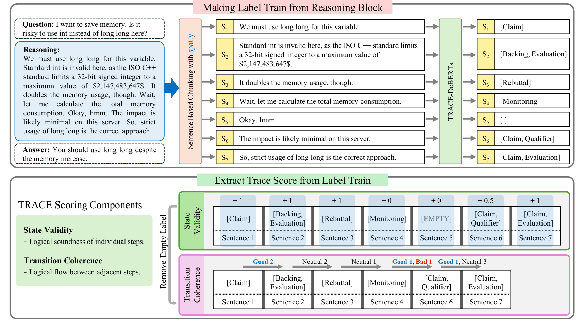

<div align="center">

# TRACE

**Toulmin-based Reasoning Assessment through Constructive Elements for LLM CoT Evaluation**

*ICML 2026 Regular*

[](https://arxiv.org/abs/2605.29656)
[](https://openreview.net/forum?id=PLACEHOLDER)
[](https://huggingface.co/hyyangkisti/TRACE-DeBERTa-v3-base)

</div>

TRACE is a reference-free framework for evaluating the Chain-of-Thought (CoT) reasoning of large language models. It grounds evaluation in Toulmin's argumentation model and Flavell's metacognition theory, decomposing reasoning into sentence-level constructive elements and aggregating them into a single interpretable score.

<p align="center">
  
</p>

<p align="center"><em>Figure 1. Overview of the TRACE pipeline: sentence-level labeling with TRACE-DeBERTa followed by rule-based State Validity and Transition Coherence aggregation.</em></p>

## Installation

```bash
pip install -r requirements.txt
```

The spaCy `en_core_web_sm` model is pinned directly in `requirements.txt`, so no extra download step is needed.

## Quick Start

```bash
python main.py --input dataset/sample.jsonl
```

Each line of the input JSONL must be an object with `id` and `think` fields. The script segments each reasoning into sentences, labels every sentence with TRACE-DeBERTa, and writes the result to `output/{input_stem}.json`:

```json
{
  "results": [
    {
      "id": "math_001",
      "label": [{"sentence 1": ["Claim"]}, {"sentence 2": ["Backing", "Warrant"]}, {"sentence 3": []}],
      "num_sentences": 30,
      "score": 0.6453
    }
  ],
  "total_samples": 2,
  "mean_score": 0.6321
}
```

## Pipeline Overview

TRACE runs in two stages:

1. **Sentence labeling.** Reasoning text is split with spaCy and multi-labeled by [`hyyangkisti/TRACE-DeBERTa-v3-base`](https://huggingface.co/hyyangkisti/TRACE-DeBERTa-v3-base) across 8 constructive elements (Claim, Data/Evidence, Warrant, Backing, Qualifier, Rebuttal, Monitoring, Evaluation).
2. **Score extraction.** A rule-based aggregator computes **State Validity** (V_state) and **Transition Coherence** (C_trans), combined as `TRACE = α · V_state + (1 − α) · C_trans` with α = 0.7.

## Repository Structure

```
trace/
├── main.py              # Entry point: --input {dataset}.jsonl -> {output}.json
├── dataset/             # Input JSONL files
│   └── sample.jsonl
├── output/              # Generated score JSONs (gitignored)
├── eval/                # Inference and score computation
│   ├── inference.py     # TRACE-DeBERTa wrapper
│   ├── parser.py        # spaCy sentence splitter
│   └── calculate.py     # State Validity, Transition Coherence, TRACE
└── src/
    ├── util.py          # Pipeline glue (load JSONL -> label -> score -> save)
    └── img/             # Figures used by README
```

## Citation

```bibtex
@misc{kim2026tracetoulminbasedreasoningassessment,
      title={TRACE: Toulmin-based Reasoning Assessment through Constructive Elements for LLM CoT Evaluation}, 
      author={Yundong Kim and Heyoung Yang},
      year={2026},
      eprint={2605.29656},
      archivePrefix={arXiv},
      primaryClass={cs.AI},
      url={https://arxiv.org/abs/2605.29656}, 
}
```
